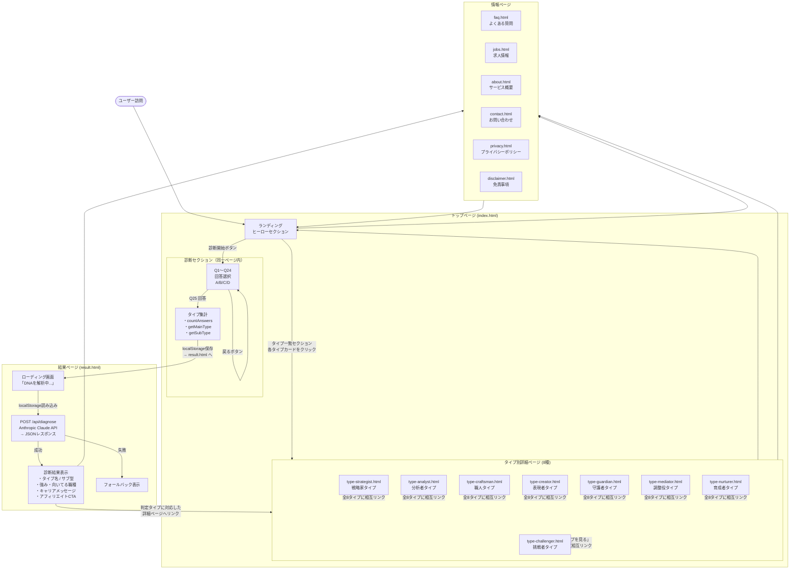
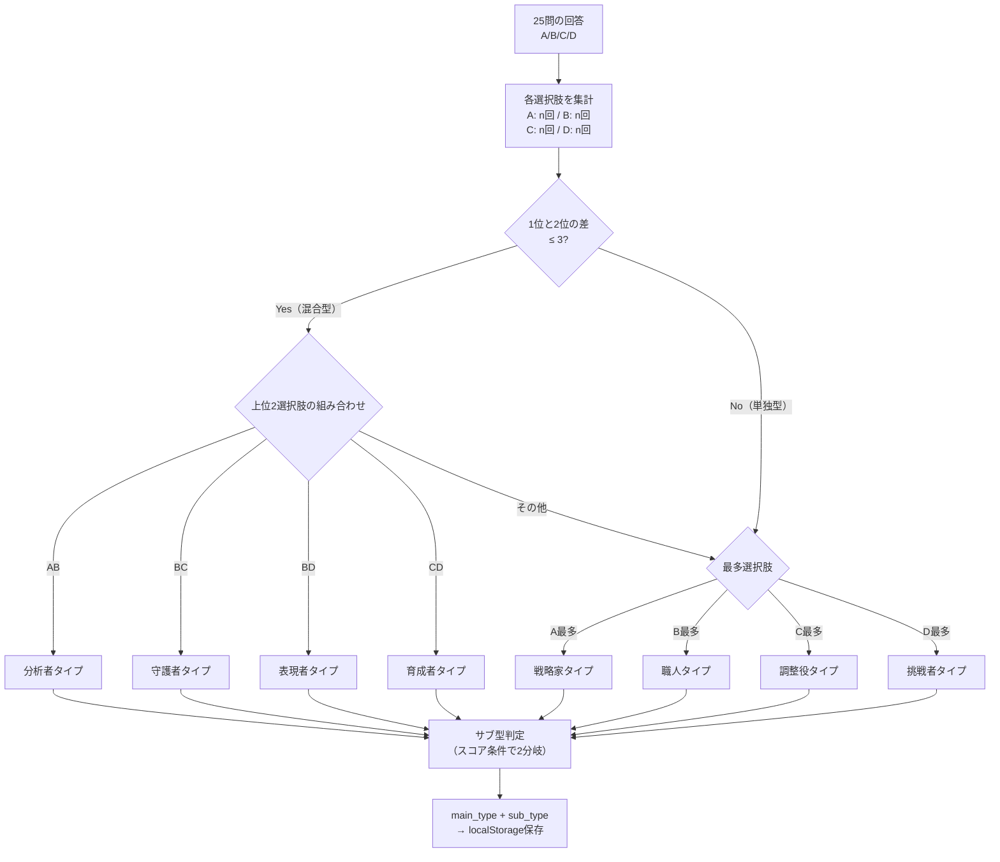
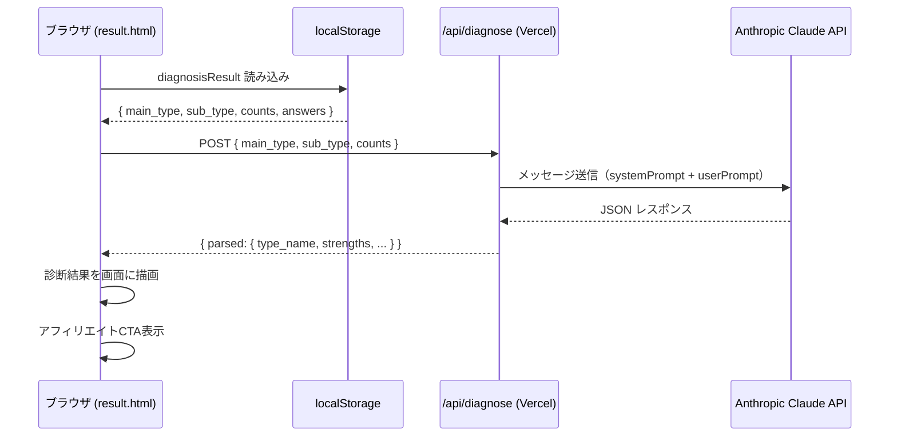

# キャリアDNA サイト遷移図（個人用メモ）

## ユーザーフロー

### タイプページへの遷移元まとめ

| 遷移元 | 経路 |
|---|---|
| result.html | 診断完了後、判定タイプに対応したページへリンク表示 |
| index.html | タイプ一覧セクションの各カードから直接リンク |
| 各タイプページ | 「他のタイプを見る」セクションで全8タイプに相互リンク |

---

## タイプ判定ロジック

---

## API通信フロー

